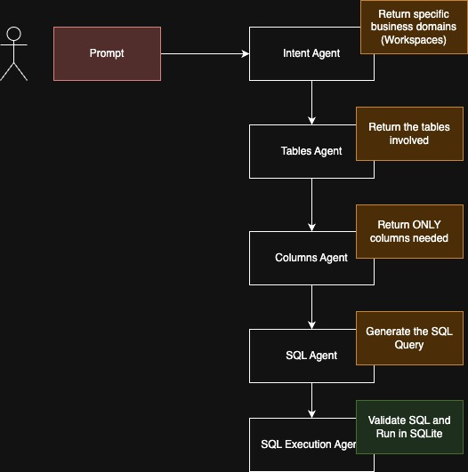

# QueryGPT

This is an implementation of QueryGPT from Uber including 3 agents using LangGraphjs

The idea of the implementation is a POC for how would such setup work, where there is 3 agents:
- **Intent Agent** identifing the business domains the user is asking about with natural language
- **Table Agent** once handed off the business domains, the agent will decide from the database which table it can use.
- **Columns Agent** As now the knowledge includes the tables needed, the columns agent will make sure only the columns needed are included to prevent including extra data for no reason.
- **SQL Agent** turns eventually the prompt into a SQL query that can be executed on the database.
- **SQL Execution Agent** to run the query and return the results



## Dataset Used
Northwind for SQLLite from [SQLite3 version of Microsoft's Northwind Database on Github](https://github.com/jpwhite3/northwind-SQLite3?tab=readme-ov-file)

### Tables

| Table Name                        | Table Name                        |
|-----------------------------------|-----------------------------------|
| Alphabetical list of products     | Orders Qry                        |
| Categories                        | Product Sales for 1997            |
| Category Sales for 1997           | ProductDetails_V                  |
| Current Product List              | Products                          |
| Customer and Suppliers by City    | Products Above Average Price      |
| CustomerCustomerDemo              | Products by Category              |
| CustomerDemographics              | Quarterly Orders                  |
| Customers                         | Regions                           |
| EmployeeTerritories               | Sales Totals by Amount            |
| Employees                         | Sales by Category                 |
| Invoices                          | Shippers                          |
| Order Details                     | Summary of Sales by Quarter       |
| Order Details Extended            | Summary of Sales by Year          |
| Order Subtotals                   | Suppliers                         |
| Orders                            | Territories                       |

## Sample Output

```bash
========== Intent Agent Result ==========
The relevant workspace involved in your query is: Employee & Territories.
=========================================
========== Tables Agent Result ==========
Employees, EmployeeTerritories, Territories, Regions
=========================================
===== Column Pruner Agent Result =====
Based on your query, the relevant columns from the tables are as follows:

Employees: EmployeeID, LastName, FirstName, Title, TitleOfCourtesy, BirthDate, HireDate, Address, City, Region, PostalCode, Country, HomePhone, Extension, Photo, Notes, ReportsTo, PhotoPath
EmployeeTerritories: EmployeeID, TerritoryID

======================================
=========== SQL Agent Result ===========
SELECT COUNT(*) FROM `Employees`;
========================================
====== SQL Execution Agent Result ======
{"employee_count":9}
=========================================
```

## Contributing
We welcome contributions! Please read our [contributing guidelines](CONTRIBUTING.md) for more details.

## License
This project is licensed under the MIT License. See the [LICENSE](LICENSE) file for details.

## Acknowledgements
Special thanks to the team at Farabi Innovations for their support and guidance.